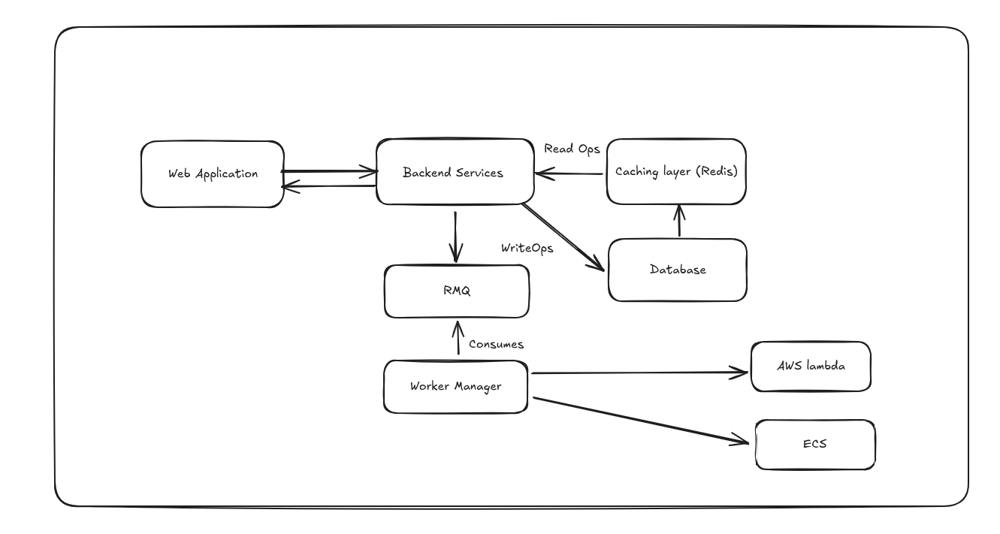

### Sedstart Architecture:

**Backend Component:** The backend component initiates the job and then then subscribes to the RMQ, hoping the worker manager will accept the request and then process it further.

**Worker Manager Component:**
It works as a dispatcher for handling the async operations from the backend and sends the requests to RMQ where post that messages are consumed by the workers and then being executed by the [lambda functions](#lambda-functions) or the [ECS/Fargate](#ecs) depending upon the use case.

#### Lambda functions ####
Lambda function is a stateless service provided by AWS, which can process tasks, provision compute resources for the request based on a event triggering mechanism. The clien pays for the call made. Every execution has to be finished by 15 mins. 

**Limitations of using Lambda functions:**

- Compute limitation: Upto 10GB memory 6vCPUs
- Execution time limitation: Not ideal for long running jobs.
- Cold starts: It will basically spin up a container and then start processing, which will have an effect on latency.

#### ECS ####