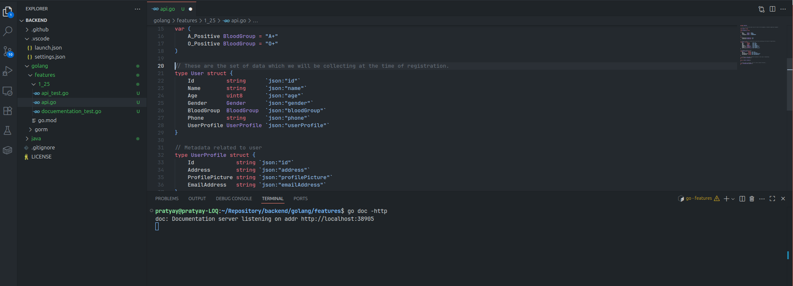
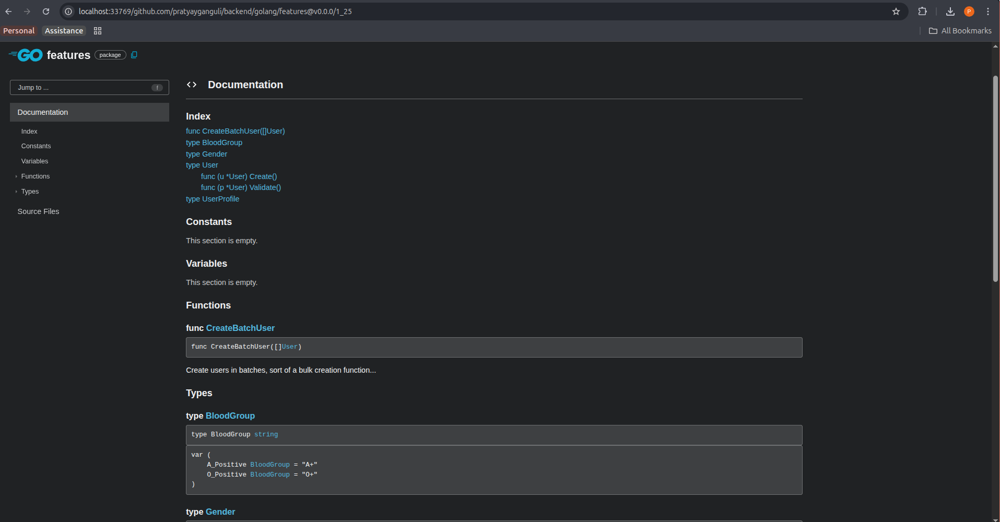

## Golang 1.25 Features ##

* **Go Doc**: Now using the `go doc` command you can start your local documentation server. Building source code documentation has become a lot easier with this implementation. Here is an example to demonstarte how easy it is to generate documentation.

    * Add appropiate comments while writing the code.
    
    * Navigate to the package directory and run the command `go doc -http` you may specify the port if required.
    * Local documentation server will be started and you will be redirected to the documentation page in your browser.
    